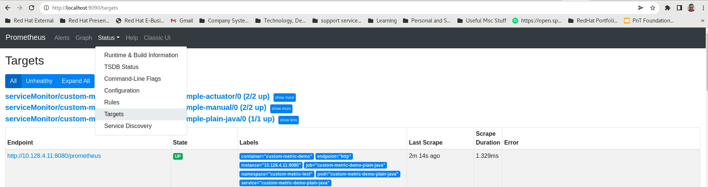
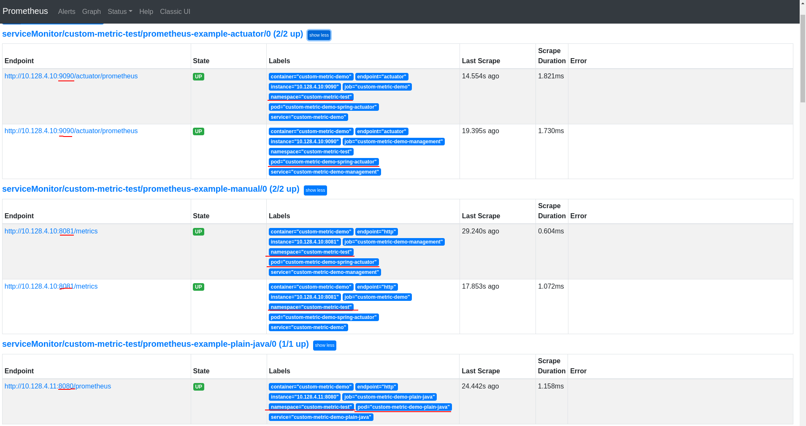
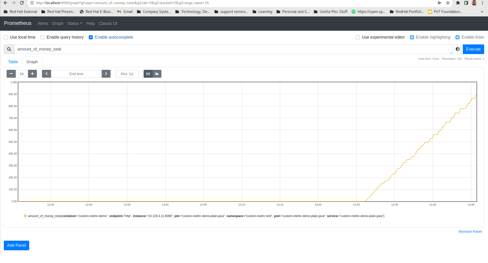

# Create Custom Application Metrics in JAVA for Prometheus

## Main Goal - Provide Several ways to create custom application Metrics to be pulled and scraped  by Prometheus

### Objectives:
  1. Create custom metrics from java application Using Micrometer Facade Instrumentation Library
  2. Expose The metrics via HTTP endpoint: \
     a. By using Spring Actuator to expose it automatically with all other prometheus metrics of endpoint `/actuator/prometheus` \
     b. By manually creating an endpoint using Spring MVC Controller\
     c. By manually creating endpoint using JAVA HttpServer.\
     d. In general , Can be exposed with any mechanism or class that implements a HTTP Server, As long as you creating a response body with the prometheus text format.
  3. Show how to use `OpenShift Container Platform monitoring` in order to let Prometheus instance )that
     runs on OCP cluster) to pull these custom metrics. 
     
#### Procedures:
1. Creating And exposing Metrics using MicroMeter and Springboot Actuator [here](./springboot-actuator) - reduces a lot of boilerplate code and work.
2. Creating And exposing Metrics using MicroMeter And JAVA HTTPServer [here](./micrometer-java)
3. Deploy both Applications on Openshift and configure Prometheus To Scrape their metrics endpoints:\
**Note: Needs a privileges of cluster admin as a prerequisite**

   1. Log to an openshift Cluster Using your credentials.
   2. Enable Collection/pulling of application metrics by enabling User Workload property in configmap of cluster monitoring:
    ```shell
    cat > cluster-monitoring-config.yaml << EOF
    apiVersion: v1
    kind: ConfigMap
    metadata:
      name: cluster-monitoring-config
      namespace: openshift-monitoring
    data:
      config.yaml: |
        enableUserWorkload: true
    EOF
   
    [zgrinber@zgrinber openshift-prometheus]$ oc apply -f cluster-monitoring-config.yaml
    ```
   3. Define resources and retention policy for user workloads in prometheus:
    ```shell
    cat > user-workload-monitoring-config.yaml << EOF
    apiVersion: v1
    kind: ConfigMap
    metadata:
      name: user-workload-monitoring-config
      namespace: openshift-user-workload-monitoring
    data:
      config.yaml: |
        prometheus: 
          retention: 24h 
          resources:
            requests:
              cpu: 200m 
              memory: 2Gi 
    EOF   
    [zgrinber@zgrinber openshift-prometheus]$ oc apply -f user-workload-monitoring-config.yaml       
    ```                   
   4. Now You should see that all the pods of the openshift user workload monitors are up and running, and if not wait for them to be all up and running:
   ```shell
    [zgrinber@zgrinber openshift-prometheus]$ oc get pods -n openshift-user-workload-monitoring
    NAME                                   READY   STATUS    RESTARTS   AGE
    prometheus-operator-6f598b9f6c-nshgg   2/2     Running   0          2d
    prometheus-user-workload-0             5/5     Running   1          34h           
    prometheus-user-workload-1             5/5     Running   1          2d
    thanos-ruler-user-workload-0           3/3     Running   0          33h
    thanos-ruler-user-workload-1           3/3     Running   0          33h
   ```
                                                                  
   5. Create a new project to install the two applications:
   ```shell
                                                                      
   [zgrinber@zgrinber openshift-prometheus]$ oc new-project custom-metric-test
   
   ```                                                             
   6. Install the two demo applications with custom metrics:
   ```shell
   [zgrinber@zgrinber custom-metrics-java]$ cd openshift-prometheus/
   [zgrinber@zgrinber openshift-prometheus]$ oc apply -f pods.yaml
   [zgrinber@zgrinber openshift-prometheus]$ oc get pods --show-labels 
   NAME                                 READY   STATUS    RESTARTS   AGE   LABELS
   custom-metric-demo-plain-java        1/1     Running   1          15s   app=prometheus-plain-java
   custom-metric-demo-spring-actuator   1/1     Running   1          15s   app=prometheus-actuator-spring-boot
   ```
   7. Create services that will route traffic and will point to the applications' pods:
   ```shell
   [zgrinber@zgrinber openshift-prometheus]$ oc apply -f services.yaml
   ```
   8.Verify that the services were created and that their selectors are matching the pods's labels:
   ```shell
   [zgrinber@zgrinber openshift-prometheus]$ oc get svc -o wide
   NAME                            TYPE        CLUSTER-IP       EXTERNAL-IP   PORT(S)    AGE   SELECTOR
   custom-metric-demo              ClusterIP   172.30.213.217   <none>        8081/TCP   15h   app=prometheus-actuator-spring-boot
   custom-metric-demo-management   ClusterIP   172.30.89.70     <none>        9090/TCP   15h   app=prometheus-actuator-spring-boot
   custom-metric-demo-plain-java   ClusterIP   172.30.79.75     <none>        8080/TCP   15h   app=prometheus-plain-java
   ```        
   9. Create External routes for the service to enable external access to the services and verify that they routed to the right services:
   ```shell
   [zgrinber@zgrinber openshift-prometheus]$ oc apply -f routes.yaml 
   route.route.openshift.io/custom-metric-demo created  
   route.route.openshift.io/custom-metric-demo-management created
   route.route.openshift.io/custom-metric-demo-plain-java created  
   
   [zgrinber@zgrinber openshift-prometheus]$ oc get routes 
   NAME                            HOST/PORT                                                                          PATH   SERVICES                        PORT   TERMINATION   WILDCARD
   custom-metric-demo              custom-metric-demo-custom-metric-test.apps.tem-lab01.fsi.rhecoeng.com                     custom-metric-demo              8081                 None
   custom-metric-demo-management   custom-metric-demo-management-custom-metric-test.apps.tem-lab01.fsi.rhecoeng.com          custom-metric-demo-management   9090                 None
   custom-metric-demo-plain-java   custom-metric-demo-plain-java-custom-metric-test.apps.tem-lab01.fsi.rhecoeng.com          custom-metric-demo-plain-java   8080                 None
   ```  
   10. Now create the ServiceMonitor custom resource instances to indicate that the services endpoints will be pulled and scraped by 
      Prometheus on cluster, for the givens paths:
   ```shell
   [zgrinber@zgrinber openshift-prometheus]$ oc apply -f service-monitors.yaml
   [zgrinber@zgrinber openshift-prometheus]$ oc get servicemonitors  
   NAME                            AGE
   prometheus-example-actuator     12s
   prometheus-example-manual       12s
   ```
   11. Now using the route, run a loop with 100 invocations of a test http endpoint, to
       let the metrics counter to be incremented with each invocation:
   ```shell
   [zgrinber@zgrinber openshift-prometheus]$ for i in {1..100} ; do curl -v -X GET "http://custom-metric-demo-plain-java-custom-metric-test.apps.tem-lab01.fsi.rhecoeng.com/make-booking?item=$i&amount=$i" ; echo  ;  done
   ```
   12.After the loop finished successfully, you can check on prometheus that the metrics' endpoints registered as targets:
   ```shell
   [zgrinber@zgrinber openshift-prometheus]$ oc  port-forward -n openshift-user-workload-monitoring pod/prometheus-user-workload-0 9090
   ``` 
   13. Open a web browser to [http://localhost:9090](http://localhost:9090])
   14. On the top level menu, go to Status sub-menu--> and click on Targets:
   
   15. See all endpoints that we created and defined, which are being pulled and scraped by prometheus 
   
   16. Check actual metric Data on Prometheus UI, for example, we defined a demo metric
       called `amount_of_money_total` and how its value changed over time:
   
   
#### Connect User-Workload Prometheus in Openshift as Data Source in Grafana
1. First, need to fetch the secret that contains the TOKEN for accessing Prometheus user-workloads instance:
```shell
[zgrinber@zgrinber ~]$ SECRET=`oc get secret -n openshift-user-workload-monitoring | grep  prometheus-user-workload-token | head -n 1 | awk '{print $1 }'`
```
2. Now extract and decode the token itself out of the secret we got:
```shell
[zgrinber@zgrinber ~]$ TOKEN=`echo $(oc get secret $SECRET -n openshift-user-workload-monitoring -o json | jq -r '.data.token') | base64 -d`
```
3. Get the route of Thanos querier(implementor of the prometheus API):
```shell
[zgrinber@zgrinber ~]$ THANOS_QUERIER_HOST=`oc get route thanos-querier -n openshift-monitoring -o json | jq -r '.spec.host'`
```
4. Verify that all 3 environment variables populated, as expected.
```shell
[zgrinber@zgrinber ~]$ echo secret=$SECRET ; echo ; echo  token=$TOKEN  ; echo ; echo thanos-route=$THANOS_QUERIER_HOST
```
5. lookup for a granfana instance that you have on it all permissions, and get its route first:
```shell
[zgrinber@zgrinber ~]$  oc get route -A | grep grafana
monitoring-documenting               grafana-route                                             grafana-route-monitoring-documenting.apps.tem-lab01.fsi.rhecoeng.com               /                             grafana-service                       3000          edge                   None
monitoring-poc                       grafana                                                   grafana-monitoring-poc.apps.tem-lab01.fsi.rhecoeng.com                                                           grafana-service                       grafana                              None
openshift-monitoring                 grafana                                                   grafana-openshift-monitoring.apps.tem-lab01.fsi.rhecoeng.com                                                     grafana                               https         reencrypt/Redirect     None
```
6. Take the appropriate route, and Access it through a web browser, after logging in,
   Go to Configuration menu on the left panel-->Click on Data
   source--> click on add data source--> Choose Prometheus, and fill in the fields according
   to the following, and afterwards click on save & Test.
```properties
Name=Prometheus-user-workloads
URL= Paste in the value of THANOS_QUERIER_HOST environment variable from section 3.
Access=Server(default)
Skip TLS Verify=On
Custom HTTP Headers:
  Header: Authorization
  Value: Bearer $TOKEN(Where token is the environment variable defined in section 2, take its value and replace with $TOKEN).
HTTP Method: GET
```

